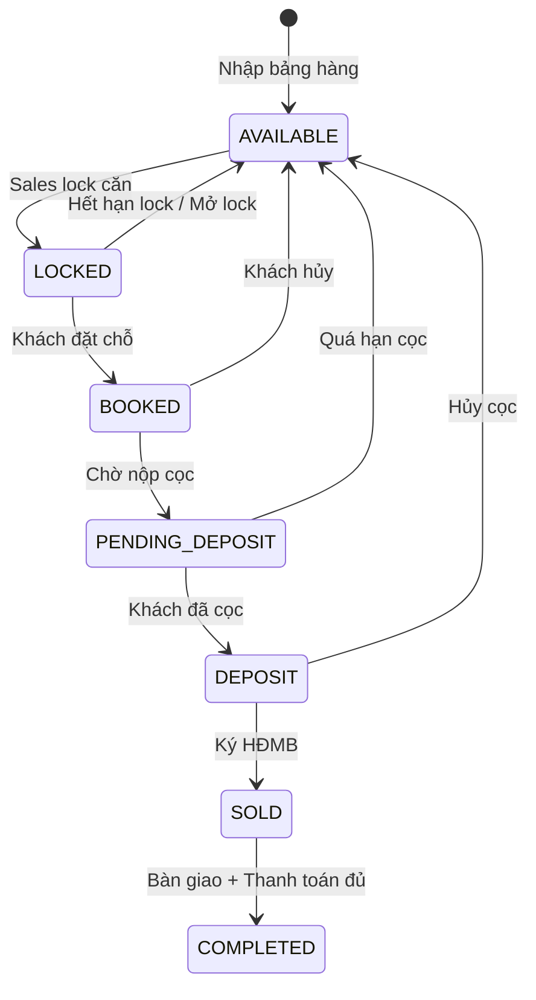
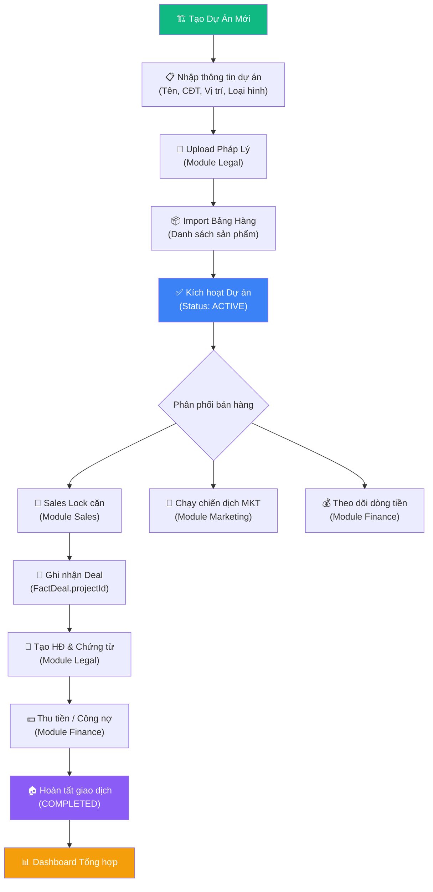
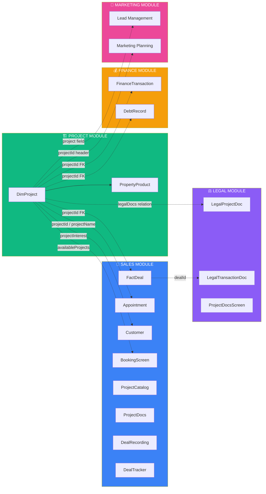
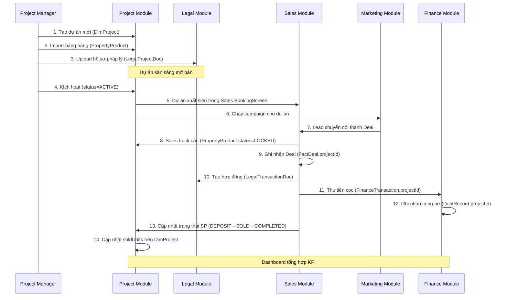

# 📊 Phân Tích Nghiệp Vụ Chi Tiết — Phân Hệ DỰ ÁN (Project Module)

> **SGROUP ERP** — Báo cáo phân tích ngày 13/03/2026

---

## 1. Tổng Quan Phân Hệ

| Thuộc tính | Chi tiết |
|---|---|
| **Tên module** | Dự Án (Project) |
| **Mục đích** | Quản lý danh mục dự án bất động sản, bảng hàng sản phẩm (căn hộ/biệt thự/shophouse), theo dõi tiến độ bán hàng |
| **Đối tượng sử dụng** | Project Manager, Sales Director, CEO, Admin, Sales Manager, Sales |
| **Số màn hình** | 3 chính + 1 detail view |
| **Backend** | REST API tại `/projects` và `/projects/:id/products` |
| **Database** | 2 bảng: `DimProject`, `PropertyProduct` (PostgreSQL via Prisma) |

---

## 2. Mô Hình Dữ Liệu

### 2.1 DimProject (Dự án)

| Trường | Kiểu | Mô tả |
|---|---|---|
| `id` | UUID v7 | Khóa chính |
| `projectCode` | String (unique) | Mã dự án (VD: `DA001`) |
| `name` | String | Tên dự án |
| `developer` | String? | Chủ đầu tư |
| `location` | String? | Vị trí dự án |
| `type` | String? | Loại hình: Chung cư, Biệt thự, Shophouse |
| `feeRate` | Float | Phí môi giới mặc định (%) |
| `avgPrice` | Float | Giá bán trung bình (Tỷ VND) |
| `totalUnits` | Int | Tổng số sản phẩm |
| `soldUnits` | Int | Số sản phẩm đã bán |
| `status` | Enum | `ACTIVE` · `PAUSED` · `CLOSED` |
| `startDate` / `endDate` | DateTime? | Thời gian mở/đóng bán |
| `legalDocs` | Relation | → `LegalProjectDoc[]` |

### 2.2 PropertyProduct (Sản phẩm BĐS)

| Trường | Kiểu | Mô tả |
|---|---|---|
| `id` | UUID v7 | Khóa chính |
| `projectId` | String (FK) | Thuộc dự án nào |
| `code` | String (unique) | Mã căn (VD: `A1-0201`) |
| `block` / `floor` | String? / Int | Tòa / Tầng |
| `area` | Float | Diện tích (m²) |
| `price` | Float | Giá bán (Tỷ VND) |
| `direction` | String? | Hướng nhà |
| `bedrooms` | Int | Số phòng ngủ |
| `status` | Enum | 7 trạng thái (xem bên dưới) |
| `bookedBy` | String? | Nhân viên giữ chỗ |
| `lockedUntil` | DateTime? | Thời hạn lock căn |
| `customerPhone` | String? | SĐT khách hàng |

---

## 3. Luồng Nghiệp Vụ Chính

### 3.1 Vòng Đời Sản Phẩm BĐS (Property Lifecycle)

### 3.2 Quy Trình Quản Lý Dự Án End-to-End

---

## 4. Các Màn Hình & Chức Năng

### 4.1 Tổng Quan Dự Án (Dashboard)
**File:** [ProjectDashboard.tsx](file:///d:/SGROUP%20ERP%20FULL/SGROUP-ERP-UNIVERSAL/src/features/project/screens/ProjectDashboard.tsx)

| KPI Card | Nguồn dữ liệu | Cách tính |
|---|---|---|
| Tổng Dự án | `projects.length` | Đếm tất cả |
| Đang mở bán | `status === 'ACTIVE'` | Lọc ACTIVE |
| Tổng Sản phẩm | `sum(totalUnits)` | Cộng dồn |
| Đã Bán | `sum(soldUnits)` | Cộng dồn |
| Thanh khoản | `soldUnits / totalUnits` | Tỷ lệ % |
| Tổng giá trị | `avgPrice × totalUnits` | Ước tính pipeline |

### 4.2 Danh Mục Dự Án (Project List)
**File:** [ProjectListScreen.tsx](file:///d:/SGROUP%20ERP%20FULL/SGROUP-ERP-UNIVERSAL/src/features/project/screens/ProjectListScreen.tsx)

- Hiển thị danh sách dạng card 2 cột
- Tìm kiếm theo Tên / Mã / Chủ đầu tư
- Badge trạng thái (ĐANG BÁN / PAUSED / CLOSED)
- Nút **Chi tiết** → `ProjectDetailView`
- Nút **Xem Bảng Hàng** (chưa tích hợp navigate)
- Nút **Thêm Dự án** (placeholder)

### 4.3 Quản Lý Bảng Hàng (Inventory)
**File:** [InventoryScreen.tsx](file:///d:/SGROUP%20ERP%20FULL/SGROUP-ERP-UNIVERSAL/src/features/project/screens/InventoryScreen.tsx)

- Tab chọn dự án theo horizontal scroll
- Grid 4 cột sản phẩm với mã màu theo trạng thái
- Nút **Lock Căn** / **Mở Lock** theo trạng thái
- Hiển thị thông tin: mã căn, tầng, phòng ngủ, diện tích, giá, trạng thái

### 4.4 Chi Tiết Dự Án (Detail View)
**File:** [ProjectDetailView.tsx](file:///d:/SGROUP%20ERP%20FULL/SGROUP-ERP-UNIVERSAL/src/features/project/screens/ProjectDetailView.tsx)

- Layout 2 cột: thông tin chung (trái) + danh sách SP (phải)
- Hiển thị: CĐT, vị trí, loại hình, quy mô, tiến độ bán, giá TB, hoa hồng
- Bảng sản phẩm: Mã căn, Block/Tầng, Diện tích, Giá bán, Trạng thái

---

## 5. Liên Hệ Với Các Module Khác

### 5.1 Sơ Đồ Tổng Thể Liên Module

### 5.2 Chi Tiết Liên Kết Theo Module

#### 🔗 Sales ↔ Project (Liên kết MẠNH)

| Điểm liên kết | Mô tả | File tham chiếu |
|---|---|---|
| `FactDeal.projectId` | Mỗi deal bán hàng gắn với 1 dự án | [schema.prisma#L363](file:///d:/SGROUP%20ERP%20FULL/sgroup-erp-backend/prisma/schema.prisma#L363) |
| `FactDeal.projectName` | Tên dự án denormalize trên deal | [schema.prisma#L364](file:///d:/SGROUP%20ERP%20FULL/sgroup-erp-backend/prisma/schema.prisma#L364) |
| `Appointment.projectId/Name` | Lịch hẹn khách gắn dự án | [schema.prisma#L563-L564](file:///d:/SGROUP%20ERP%20FULL/sgroup-erp-backend/prisma/schema.prisma#L563-L564) |
| `Customer.projectInterest` | Khách quan tâm dự án nào | [schema.prisma#L515](file:///d:/SGROUP%20ERP%20FULL/sgroup-erp-backend/prisma/schema.prisma#L515) |
| `BookingScreen` | Chọn dự án từ `availableProjects` store | [BookingScreen.tsx](file:///d:/SGROUP%20ERP%20FULL/SGROUP-ERP-UNIVERSAL/src/features/sales/screens/Booking/BookingScreen.tsx) |
| `DealRecording` | Hiển thị cột "DỰ ÁN" trên bảng ghi nhận deal | [DealRecording.tsx](file:///d:/SGROUP%20ERP%20FULL/SGROUP-ERP-UNIVERSAL/src/features/sales/screens/DealRecording.tsx) |
| `ProjectCatalog` | Admin quản lý dự án trong Sales shell | [SalesShell.tsx#L60](file:///d:/SGROUP%20ERP%20FULL/SGROUP-ERP-UNIVERSAL/src/features/sales/SalesShell.tsx#L60) |
| `ProjectDocs` | Tài liệu dự án cho sales | [SalesShell.tsx#L52](file:///d:/SGROUP%20ERP%20FULL/SGROUP-ERP-UNIVERSAL/src/features/sales/SalesShell.tsx#L52) |

#### 🔗 Legal ↔ Project (Liên kết TRUNG BÌNH)

| Điểm liên kết | Mô tả |
|---|---|
| `LegalProjectDoc.projectId` | FK trực tiếp → `DimProject.id` (relation Prisma) |
| `LegalProjectDoc.project` | Prisma relation object |
| `ProjectDocsScreen` | CRUD hồ sơ pháp lý dự án (1/500, giấy phép XD, chứng nhận) |
| `LegalDashboard` | Hiển thị KPI `totalProjectDocs` và `activeProjects` |
| `DimProject._count.legalDocs` | API trả về số hợ sơ pháp lý mỗi dự án |

#### 🔗 Finance ↔ Project (Liên kết YẾU — chỉ qua FK)

| Điểm liên kết | Mô tả |
|---|---|
| `FinanceTransaction.projectId` | Phiếu thu/chi có thể gắn dự án |
| `DebtRecord.projectId` | Công nợ (phải thu CĐT/khách) gắn dự án |

> [!WARNING]
> Finance ↔ Project chỉ có FK trong schema, **chưa có relation Prisma** và **chưa có UI tích hợp** ở frontend.

#### 🔗 Marketing ↔ Project (Liên kết YẾU — mock data)

| Điểm liên kết | Mô tả |
|---|---|
| `LeadManagement` | Lead có trường `project` (mock data: "SG Center", "SG Nest") |
| `MarketingPlanning` | Header hiển thị `projectId` |

> [!NOTE]
> Marketing module hiện dùng mock data, chưa có tích hợp API thực với Project module.

#### 🔗 HR ↔ Project (Không có liên kết trực tiếp)

HR module không reference trực tiếp tới Project. Liên kết gián tiếp qua `SalesStaff.hrEmployeeId` → `HrEmployee` và `SalesTeam.departmentId` → `HrDepartment`.

---

## 6. Luồng Nghiệp Vụ Tích Hợp (Cross-Module Workflow)

---

## 7. Phân Tích GAP (Thiếu Sót)

### 7.1 Gaps Nghiêm Trọng 🔴

| # | Gap | Ảnh hưởng | Đề xuất |
|---|---|---|---|
| G1 | **PropertyProduct không có FK relation tới DimProject** trong Prisma schema | Không join được, phải query thủ công | Thêm `@relation(fields: [projectId], references: [id])` |
| G2 | **Nút "Thêm Dự án", "Thêm Sản phẩm" là placeholder** | Admin không CRUD được qua UI | Implement modal form Create/Update |
| G3 | **Lock/Unlock căn chưa gọi API** | Button không hoạt động | Gọi `updateProduct(id, {status: 'LOCKED'})` |
| G4 | **Sales BookingScreen dùng `useSalesStore.availableProjects`** (hardcoded) thay vì API projects | Dữ liệu không đồng bộ | Integrate `projectApi.getProjects()` |

### 7.2 Gaps Trung Bình 🟡

| # | Gap | Đề xuất |
|---|---|---|
| G5 | Finance module chưa có Prisma relation đến DimProject | Thêm relation + include trong API |
| G6 | Marketing LeadManagement dùng mock data cho `project` | Tích hợp Project API dropdown |
| G7 | Chưa có màn hình phân quyền theo dự án (ai được bán dự án nào) | Thêm `ProjectAssignment` model |
| G8 | Dashboard chỉ có 4 KPI tĩnh, thiếu biểu đồ xu hướng | Thêm chart timeline bán hàng |
| G9 | Nút "Xem Bảng Hàng" trên ProjectListScreen chưa navigate | Implement navigate sang InventoryScreen với filter |
| G10 | Chưa có chức năng import/export bảng hàng (Excel) | Implement upload Excel → parse → batch create |

### 7.3 Gaps Nhẹ 🟢

| # | Gap | Đề xuất |
|---|---|---|
| G11 | `soldUnits` trên DimProject phải cập nhật thủ công | Tự động tính dựa trên PropertyProduct.status |
| G12 | Thiếu audit log cho thay đổi trạng thái sản phẩm | Ghi log vào AuditLog khi Lock/Unlock/Sell |
| G13 | `ProjectScreen.tsx` chỉ là wrapper → dư thừa | Có thể export trực tiếp ProjectShell |

---

## 8. Đề Xuất Cải Tiến

### 8.1 Ngắn Hạn (Sprint 1-2)

1. **Implement CRUD Form** cho Dự án & Sản phẩm — modal create/edit với validation
2. **Kết nối Lock/Unlock API** — call `projectApi.updateProduct()` khi bấm nút
3. **Tích hợp Project API vào Sales Booking** — thay hardcoded store bằng API realtime
4. **Thêm Prisma relation** `PropertyProduct → DimProject` để optimize query

### 8.2 Trung Hạn (Sprint 3-5)

5. **Dashboard nâng cao** — biểu đồ thanh khoản theo thời gian, so sánh dự án
6. **Import bảng hàng Excel** — upload file → preview → confirm → batch insert
7. **Màn hình phân quyền dự án** — assign sales team / staff cho từng dự án
8. **Finance integration** — hiển thị dòng tiền theo dự án trên Project Detail
9. **Auto-sync soldUnits** — trigger cập nhật khi PropertyProduct chuyển status SOLD

### 8.3 Dài Hạn (Sprint 6+)

10. **Real-time inventory board** — WebSocket push khi có thay đổi trạng thái sản phẩm
11. **Mobile-first redesign** — tối ưu cho sales agents sử dụng điện thoại tại công trường
12. **AI price suggestion** — dựa trên dữ liệu giao dịch suggest giá tối ưu
13. **Map visualization** — hiển thị vị trí dự án trên bản đồ GIS

---

## 9. Ma Trận Trách Nhiệm (RACI)

| Nghiệp vụ | Project Manager | Sales Director | Sales | Admin | CEO |
|---|---|---|---|---|---|
| Tạo/Sửa dự án | **R/A** | C | — | R | I |
| Import bảng hàng | **R** | A | — | R | I |
| Upload pháp lý | R | A | — | **R** | I |
| Lock/Unlock căn | I | I | **R** | A | — |
| Xem Dashboard | R | **R** | R | R | **R** |
| Phê duyệt Booking | I | **A** | R | R | — |

> R = Responsible, A = Accountable, C = Consulted, I = Informed

---

## 10. Kết Luận

Module Dự Án là **trung tâm dữ liệu chủ đạo** (Master Data Hub) của toàn hệ thống SGROUP ERP. Nó cung cấp thông tin nền tảng cho 4/5 module còn lại (Sales, Legal, Finance, Marketing). Tuy nhiên, hiện tại nhiều tích hợp vẫn ở mức **FK đơn thuần** hoặc **mock data**, chưa có workflow end-to-end hoàn chỉnh.

**Ưu tiên hành động quan trọng nhất:**
1. ✅ Hoàn thiện CRUD UI (G2, G3)
2. ✅ Tích hợp realtime Sales ↔ Project (G4)
3. ✅ Thêm Prisma relations còn thiếu (G1, G5)
4. ✅ Import bảng hàng Excel (G10)
