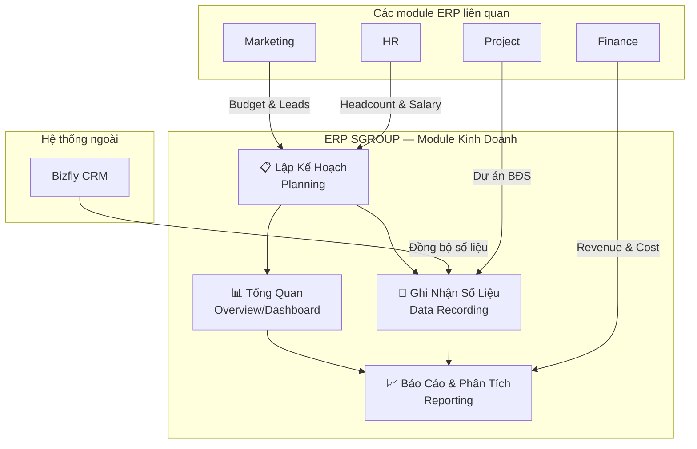
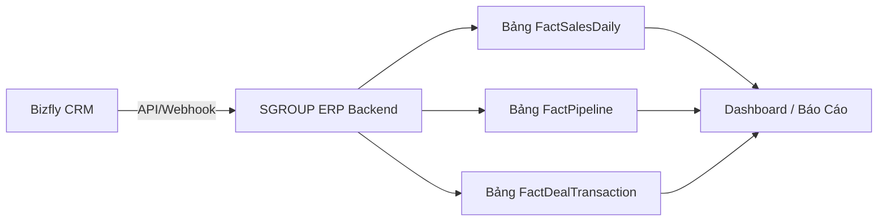
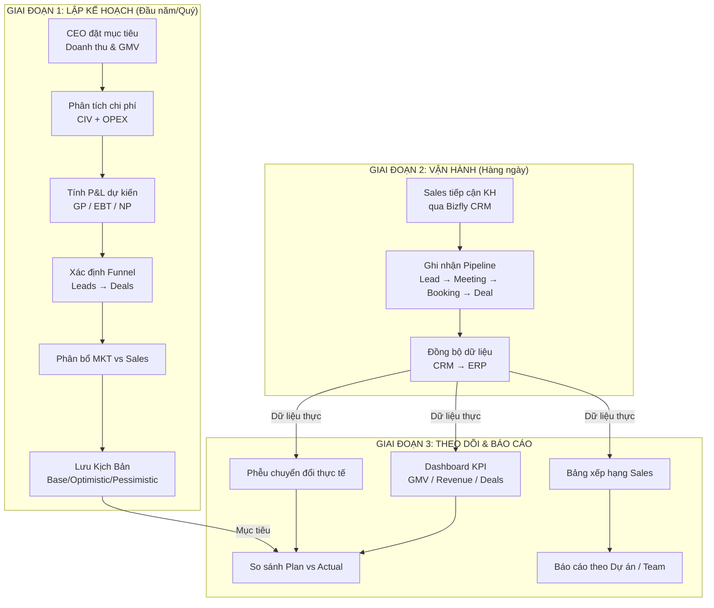
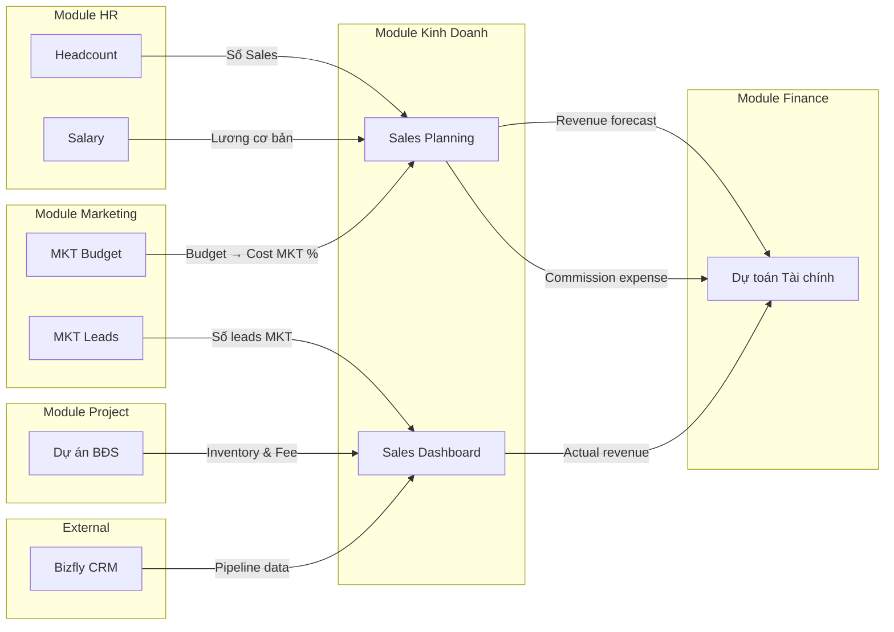

# 📊 PHÂN TÍCH NGHIỆP VỤ — PHÂN HỆ KINH DOANH (Sales Module)
## SGROUP — Công ty Môi Giới Bất Động Sản

> [!NOTE]
> Tài liệu này phân tích toàn diện nghiệp vụ module Kinh Doanh trong hệ thống ERP của SGROUP. CRM được quản lý qua **Bizfly CRM** riêng biệt — ERP chỉ **ghi nhận dữ liệu số liệu** từ CRM để tính toán kế hoạch, báo cáo và phân tích hiệu suất.

---

## 1. TỔNG QUAN MODULE KINH DOANH

### 1.1 Bối cảnh SGROUP

SGROUP là công ty **môi giới bất động sản**, mô hình kinh doanh cốt lõi:

| Đặc điểm | Mô tả |
|-----------|-------|
| **Mô hình doanh thu** | Thu **phí hoa hồng môi giới** (% trên giá trị giao dịch BĐS) |
| **Sản phẩm** | Các dự án BĐS từ chủ đầu tư (primary market) |
| **Lực lượng bán hàng** | Đội Sales inhouse + quản lý theo Team |
| **Nguồn khách hàng** | Marketing (leads mua) + Sales tự kiếm (self-gen) |
| **CRM** | Bizfly CRM (hệ thống ngoài) — không phát triển lại |

### 1.2 Phạm vi module trong ERP

### 1.3 Nguyên tắc thiết kế

> [!IMPORTANT]
> **Không xây dựng CRM** — Chỉ ghi nhận dữ liệu từ Bizfly CRM để phát triển **số liệu kế hoạch, báo cáo tài chính, và quản trị hiệu suất kinh doanh**.

---

## 2. CÁC NGHIỆP VỤ CHÍNH

### 2.1 LẬP KẾ HOẠCH KINH DOANH (Sales Planning)

Đây là nghiệp vụ **trung tâm**, cho phép CEO/BĐH lập kế hoạch kinh doanh toàn diện.

#### 2.1.1 Kế Hoạch Tổng (PlanTotal) — *Đã phát triển*

Màn hình planning CEO cấp cao nhất với 6 khối chức năng:

| # | Khối chức năng | Mô tả | Trạng thái |
|---|---------------|-------|------------|
| 1 | **Bảng Doanh Thu & Chi Phí** | Nhập doanh thu mục tiêu, phí MG bình quân, tính biến phí (CIV) | ✅ Đã có |
| 2 | **Định Phí Vận Hành (OPEX)** | Quản lý 5 nhóm: HR, Văn phòng, Tài sản, Thương hiệu, Pháp lý | ✅ Đã có |
| 3 | **Báo Cáo P&L Tóm Tắt** | Tự động tính GP, EBT, NP, ROS, Biên LN gộp | ✅ Đã có |
| 4 | **Phân Tích Điểm Hòa Vốn** | Break-even revenue, Safety margin | ✅ Đã có |
| 5 | **Phễu Bán Hàng (Funnel)** | Tính ngược từ revenue → GMV → Deals → Bookings → Meetings → Leads | ✅ Đã có |
| 6 | **Phân Bổ MKT & Sales** | Tỷ lệ leads từ Marketing vs Sales tự kiếm | ✅ Đã có |

**Các chỉ số đầu vào (Input):**

| Nhóm | Tham số | Đơn vị | Ý nghĩa |
|------|---------|--------|---------|
| Doanh thu | `targetRevenue` | Tỷ VNĐ | Doanh thu hoa hồng mục tiêu năm |
| Doanh thu | `avgFee` | % | Phí môi giới bình quân / doanh số |
| Doanh thu | `avgPrice` | Tỷ VNĐ | Giá trị trung bình 1 giao dịch BĐS |
| Biến phí | `costSaleCommission` | % doanh số | Hoa hồng cho Sales |
| Biến phí | `costMgmtCommission` | % doanh số | Hoa hồng cho Quản lý |
| Biến phí | `costMarketing` | % doanh số | Chi phí Marketing |
| Biến phí | `costBonus` | % doanh số | Thưởng nóng/thi đua |
| Biến phí | `costDiscount` | % doanh số | Chiết khấu khách hàng |
| Biến phí | `costOther` | % doanh số | Chi phí khác |
| OPEX | `hrSalaryBase` | Triệu/tháng | Lương cơ bản Sales |
| OPEX | `hrSalaryOffice` | Triệu/tháng | Lương khối văn phòng |
| Funnel | `rateDealBooking` | % | Tỷ lệ Deal/Booking |
| Funnel | `rateBookingMeeting` | % | Tỷ lệ Booking/Meeting |
| Funnel | `rateMeetingLead` | % | Tỷ lệ Meeting/Lead |
| Khác | `salesSelfGenRate` | % | Tỷ lệ Sales tự kiếm leads |
| Khác | `taxRate` | % | Thuế TNDN |

**Các chỉ số tính toán tự động (Output):**

| Chỉ số | Công thức | Ý nghĩa |
|--------|-----------|---------|
| GMV mục tiêu | `revenue / (avgFee / 100)` | Tổng giá trị giao dịch BĐS cần đạt |
| Số giao dịch | `GMV / avgPrice` | Tổng số deal cần chốt |
| GP (Lợi nhuận gộp) | `Revenue - Tổng CIV` | Doanh thu sau biến phí |
| OPEX năm | `OPEX tháng × 12 / 1000` | Tổng định phí năm (Tỷ) |
| EBT | `GP - OPEX năm` | Lợi nhuận trước thuế |
| NP (Lợi nhuận ròng) | `EBT - Thuế` | Lợi nhuận sau thuế |
| ROS | `NP / Revenue` | Biên lợi nhuận ròng |
| Break-even | `OPEX năm / (GP margin)` | Doanh thu hòa vốn |

#### 2.1.2 Kế Hoạch Sales Chi Tiết (PlanSales) — *Đã phát triển*

| Chức năng | Mô tả |
|-----------|-------|
| Mục tiêu KD | Doanh thu, GMV, số GD, giá trị TB/deal, tỷ lệ chuyển đổi, leads cần thiết |
| Cơ cấu hoa hồng | % hoa hồng Sales, % hoa hồng Quản lý → tính ra số tiền |
| Phân bổ theo Quý | Trọng số Q1-Q4 (%) → phân bổ doanh thu theo quý |

#### 2.1.3 Quản Lý Kịch Bản (Scenario Management) — *Đã phát triển*

Hỗ trợ 3 kịch bản song song:

| Kịch bản | Mức độ | Mục đích |
|----------|--------|---------|
| **Base** (Thực tế) | Mức cơ sở | Kế hoạch chính |
| **Optimistic** (Lạc quan) | Mức cao | Trường hợp thuận lợi |
| **Pessimistic** (Thận trọng) | Mức thấp | Phòng thủ/dự phòng |

---

### 2.2 TỔNG QUAN & DASHBOARD (Overview)

#### 2.2.1 Dashboard Kinh Doanh (OverviewSales) — *Đã phát triển (dữ liệu mock)*

| Khối | Nội dung | Nguồn dữ liệu |
|------|---------|---------------|
| **KPI Cards** | Doanh số GMV, Doanh thu, Số GD, Nhân sự Sales | CRM + ERP |
| **Phễu CRM** | Lead mới → Liên hệ → Hẹn gặp → Giữ chỗ → Đặt cọc → Ký HĐMB → Hoàn tất | **Bizfly CRM** |
| **Doanh số theo tháng** | Chart so sánh Target vs Actual theo tháng | ERP Planning + CRM |
| **Top Sellers** | Bảng xếp hạng Sales theo số GD/GMV | **Bizfly CRM** |

> [!IMPORTANT]
> Dữ liệu Phễu CRM và Top Sellers hiện đang dùng **mock data**. Cần tích hợp API đồng bộ từ Bizfly CRM để có dữ liệu thực.

---

### 2.3 GHI NHẬN SỐ LIỆU TỪ CRM (Data Recording) — *Cần phát triển*

Đây là phần **chưa được xây dựng** nhưng rất quan trọng — cầu nối giữa Bizfly CRM và ERP.

#### 2.3.1 Các loại số liệu cần ghi nhận từ Bizfly

| # | Loại dữ liệu | Mô tả | Tần suất |
|---|--------------|-------|----------|
| 1 | **Số lượng Leads** | Tổng leads mới theo ngày/tuần/tháng, phân theo nguồn | Hàng ngày |
| 2 | **Pipeline Progress** | Số KH ở mỗi giai đoạn phễu | Hàng ngày |
| 3 | **Số Meetings** | Cuộc hẹn gặp KH (đã xảy ra) | Hàng ngày |
| 4 | **Số Bookings** | KH đã giữ chỗ/đặt cọc | Khi phát sinh |
| 5 | **Số Deals** | Giao dịch đã chốt thành công | Khi phát sinh |
| 6 | **GMV (Doanh số)** | Tổng giá trị giao dịch | Khi phát sinh |
| 7 | **Revenue (Doanh thu)** | Hoa hồng thực nhận = GMV × fee% | Khi phát sinh |
| 8 | **Hiệu suất Sales** | Tỷ lệ chuyển đổi theo từng nhân viên | Hàng tuần |
| 9 | **Hiệu suất Team** | Tổng hợp theo đội, so với target | Hàng tuần |
| 10 | **Dự án đang bán** | Dự án nào đang active, inventory còn lại | Hàng tuần |

#### 2.3.2 Phương thức tích hợp Bizfly CRM

---

### 2.4 QUẢN LÝ TỔ CHỨC KINH DOANH — *Có data model, chưa có UI*

#### 2.4.1 Quản lý Team Sales

Đã có model `SalePlanTeam` trong database:

| Field | Ý nghĩa |
|-------|---------|
| `teamId` | Mã nhóm |
| `name` | Tên nhóm (Team Alpha, Team Beta...) |
| `leaderId` / `leaderName` | Trưởng nhóm |
| `activeFrom` / `activeTo` | Tháng hoạt động (1-12) |
| `sortOrder` | Thứ tự hiển thị |

#### 2.4.2 Quản lý Nhân Sự Sales

Đã có model `SalePlanStaff` trong database:

| Field | Ý nghĩa |
|-------|---------|
| `hoTen` | Họ tên nhân viên |
| `role` | Vai trò (Sales, Manager...) |
| `team` | Thuộc team nào |
| `leadsCapacity` | Năng lực xử lý leads/tháng |
| `rateMeeting` | Tỷ lệ hẹn gặp cá nhân |
| `rateBooking` | Tỷ lệ booking cá nhân |
| `rateDeal` | Tỷ lệ chốt deal cá nhân |

---

## 3. SƠ ĐỒ LUỒNG NGHIỆP VỤ TỔNG THỂ

---

## 4. DATA MODEL ĐỀ XUẤT MỞ RỘNG

### 4.1 Hiện trạng (Đã có)

| Model | Mục đích |
|-------|---------|
| `SalePlanLatest` | Pointer tới kế hoạch mới nhất theo năm/kịch bản |
| `SalePlanHeader` | Thông tin chung kế hoạch (target, tỷ lệ) |
| `SalePlanMonth` | Phân bổ theo tháng (weight, gmv, deals, meetings...) |
| `SalePlanTeam` | Cấu trúc team sales |
| `SalePlanStaff` | Nhân sự sales (năng lực, tỷ lệ chuyển đổi) |

### 4.2 Đề xuất bổ sung (Cần phát triển)

| Model đề xuất | Mục đích | Nguồn |
|--------------|---------|-------|
| `FactSalesDaily` | Ghi nhận số liệu hàng ngày (leads, meetings, bookings, deals, gmv) | Bizfly CRM |
| `FactDealTransaction` | Chi tiết từng giao dịch (dự án, giá, phí, sale phụ trách) | Bizfly CRM |
| `FactPipelineSnapshot` | Snapshot phễu CRM tại mỗi thời điểm | Bizfly CRM |
| `DimProject` | Danh mục dự án BĐS đang bán (tên, chủ đầu tư, vị trí, phí MG) | ERP quản lý |
| `DimTeamHistory` | Lịch sử thay đổi cấu trúc team | ERP quản lý |
| `SalesTargetMonthly` | Mục tiêu từng nhân viên/team theo tháng | ERP Planning |
| `CommissionCalc` | Bảng tính hoa hồng cho Sales/Manager theo từng deal | ERP tính toán |

---

## 5. MA TRẬN CHỨC NĂNG & TRẠNG THÁI

| # | Nhóm chức năng | Chức năng con | Trạng thái | Ưu tiên |
|---|---------------|--------------|------------|---------|
| 1 | **Planning** | Kế hoạch Tổng (P&L, Funnel, Break-even) | ✅ Hoàn thành | — |
| 2 | **Planning** | Kế hoạch Sales (Target, Hoa hồng, Quý) | ✅ Hoàn thành | — |
| 3 | **Planning** | Quản lý 3 Kịch bản | ✅ Hoàn thành | — |
| 4 | **Planning** | Lịch sử phiên bản kế hoạch | 🟡 Có model, chưa UI | P2 |
| 5 | **Planning** | Phân bổ Target theo Team/Nhân viên | 🟡 Có model, chưa UI | P1 |
| 6 | **Dashboard** | KPI Cards (GMV, Revenue, Deals, HC) | ✅ Có (mock data) | — |
| 7 | **Dashboard** | Phễu CRM | ✅ Có (mock data) | — |
| 8 | **Dashboard** | Doanh số theo tháng | ✅ Có (mock data) | — |
| 9 | **Dashboard** | Top Sales | ✅ Có (mock data) | — |
| 10 | **Data Sync** | Tích hợp API Bizfly CRM | ❌ Chưa có | **P0** |
| 11 | **Data Sync** | Ghi nhận GD thực tế (Fact tables) | ❌ Chưa có | **P0** |
| 12 | **Report** | So sánh Plan vs Actual | ❌ Chưa có | P1 |
| 13 | **Report** | Báo cáo theo Dự án | ❌ Chưa có | P1 |
| 14 | **Report** | Báo cáo theo Team/Nhân viên | ❌ Chưa có | P1 |
| 15 | **Ops** | Quản lý Dự án BĐS đang bán | ❌ Chưa có | P1 |
| 16 | **Ops** | Bảng tính Hoa hồng | ❌ Chưa có | P2 |
| 17 | **Ops** | Quản lý Team Sales (UI) | ❌ Chưa có | P2 |

---

## 6. PHÂN QUYỀN & VAI TRÒ

| Vai trò | Planning | Dashboard | Data Sync | Report |
|---------|----------|-----------|-----------|--------|
| **CEO / BĐH** | Full access (Xem + Sửa) | Full view | — | Full view |
| **Trưởng phòng KD** | Xem + Nhập kế hoạch team | Xem team mình | — | Team reports |
| **Sales Manager** | Xem kế hoạch team | Xem team mình | — | Team + cá nhân |
| **Sales** | Xem target cá nhân | Xem KPI cá nhân | — | Cá nhân |
| **Admin** | Full access | Full access | Config sync | Full access |

---

## 7. KPI & CHỈ SỐ THEO DÕI

### 7.1 KPI Tài Chính

| KPI | Công thức | Mục tiêu mẫu |
|-----|-----------|--------------|
| **Doanh thu (Revenue)** | Tổng hoa hồng nhận được | 125 Tỷ/năm |
| **GMV** | Tổng giá trị giao dịch | 2,500 Tỷ/năm |
| **GP Margin** | (Revenue - CIV) / Revenue | > 49% |
| **ROS** | Net Profit / Revenue | > 10% |
| **Break-even** | OPEX / GP margin | < 80% revenue |

### 7.2 KPI Vận Hành (Sales Ops)

| KPI | Công thức | Mục tiêu mẫu |
|-----|-----------|--------------|
| **Conversion Rate** | Deals / Leads | > 10% |
| **Avg Deal Size** | GMV / số Deals | 3.5 Tỷ |
| **Avg Fee** | Revenue / GMV | 5% |
| **Meetings/Lead** | Meetings / Leads | > 15% |
| **Booking/Meeting** | Bookings / Meetings | > 20% |
| **Deal/Booking** | Deals / Bookings | > 60% |

### 7.3 KPI Nhân Sự Sales

| KPI | Mô tả |
|-----|-------|
| **Revenue/Sales** | Doanh thu bình quân mỗi nhân viên |
| **Deals/Sales** | Số GD bình quân mỗi nhân viên |
| **Leads Capacity** | Năng lực xử lý leads |
| **Win Rate cá nhân** | Tỷ lệ chốt deal |

---

## 8. TÍCH HỢP VỚI CÁC MODULE KHÁC

---

## 9. TÓM TẮT & KHUYẾN NGHỊ

### Điểm mạnh hiện tại
- ✅ **Planning engine** hoàn chỉnh: P&L, Funnel, Break-even, 3 kịch bản
- ✅ **Data model** đã có cho Team và Staff, sẵn sàng mở rộng
- ✅ **Dashboard** đã có framework UI, chỉ cần kết nối dữ liệu thực

### Cần phát triển (theo thứ tự ưu tiên)

| Ưu tiên | Hạng mục | Lý do |
|---------|---------|-------|
| **P0** | Tích hợp Bizfly CRM API | Không có dữ liệu thực → Dashboard vô nghĩa |
| **P0** | Fact tables (ghi nhận GD) | Nền tảng cho mọi báo cáo |
| **P1** | Plan vs Actual comparison | Giá trị cốt lõi của việc lập kế hoạch |
| **P1** | Quản lý Dự án BĐS | Biết đang bán gì, phí MG bao nhiêu |
| **P1** | Phân bổ target theo team/NV | Có model nhưng chưa có UI quản lý |
| **P2** | Bảng tính hoa hồng | Tự động hóa tính commission |
| **P2** | Lịch sử kế hoạch (version) | Audit trail cho BĐH |
| **P2** | UI quản lý Team Sales | CRUD team + phân nhóm NV |

> [!TIP]
> Nên bắt đầu từ **tích hợp Bizfly CRM** → xây **Fact tables** → rồi mới xây **báo cáo Plan vs Actual**. Đây là critical path để module Kinh Doanh tạo ra giá trị thực.
