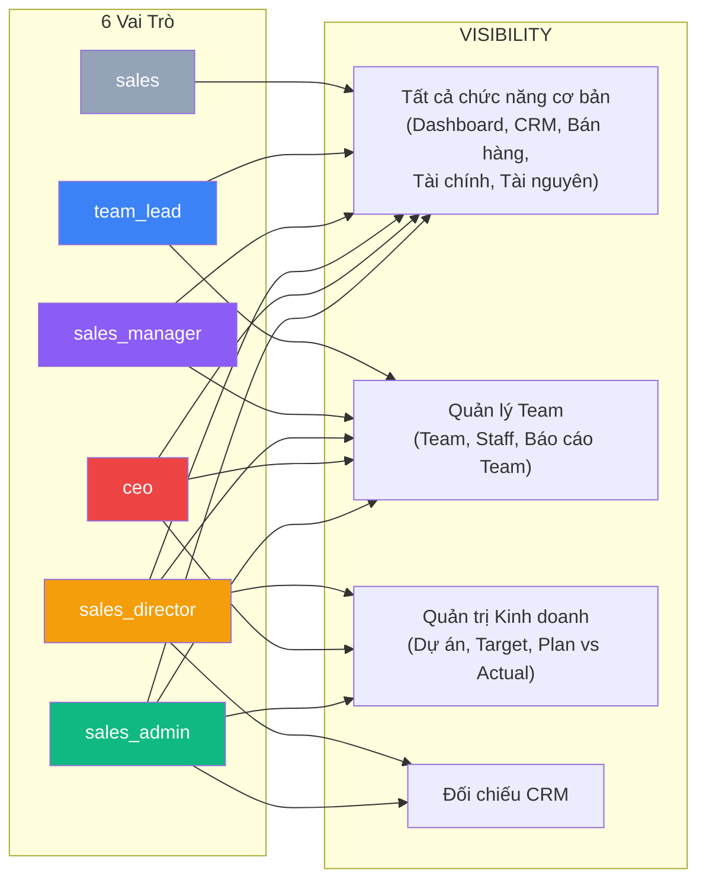
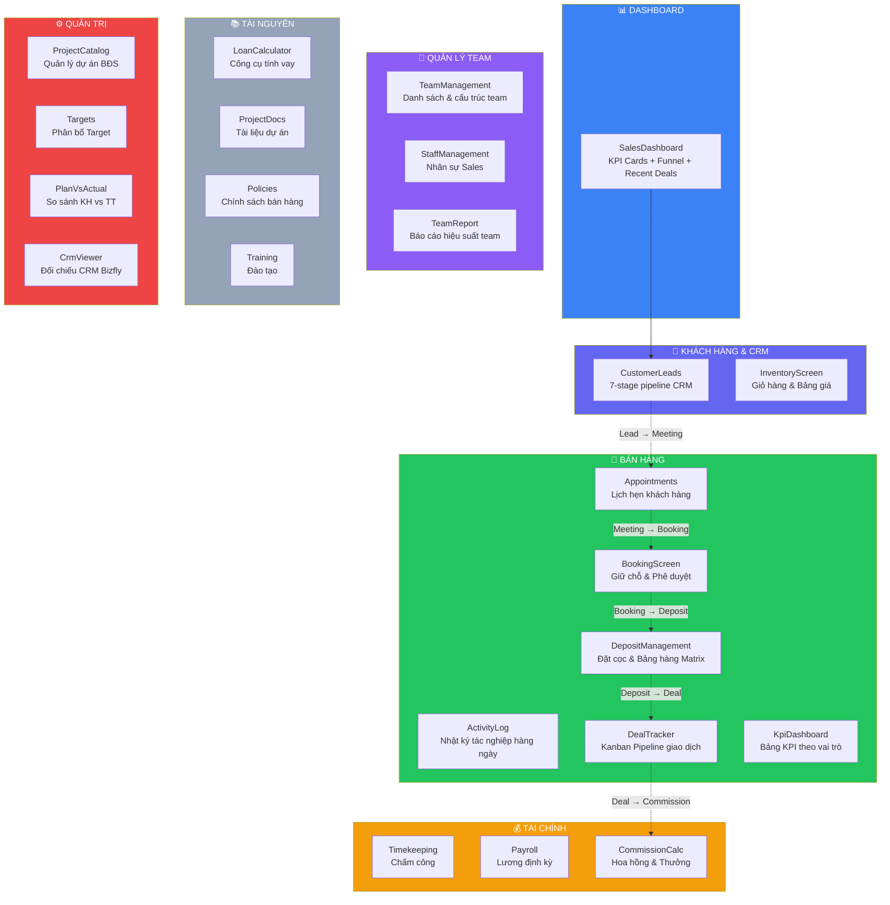
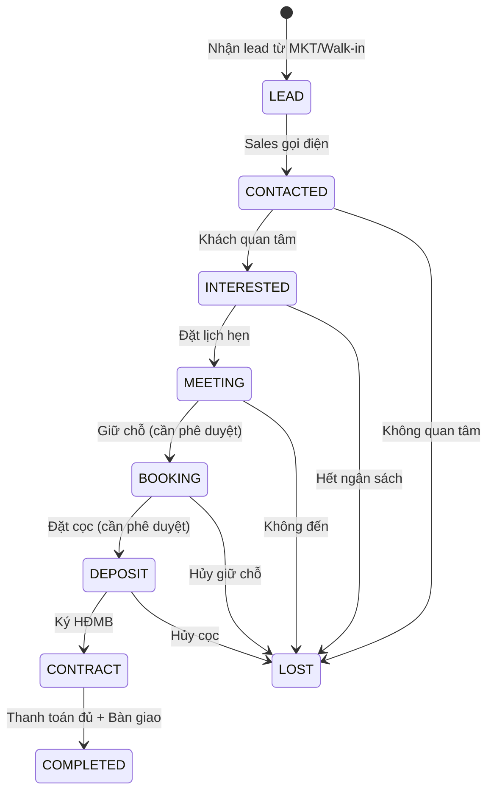
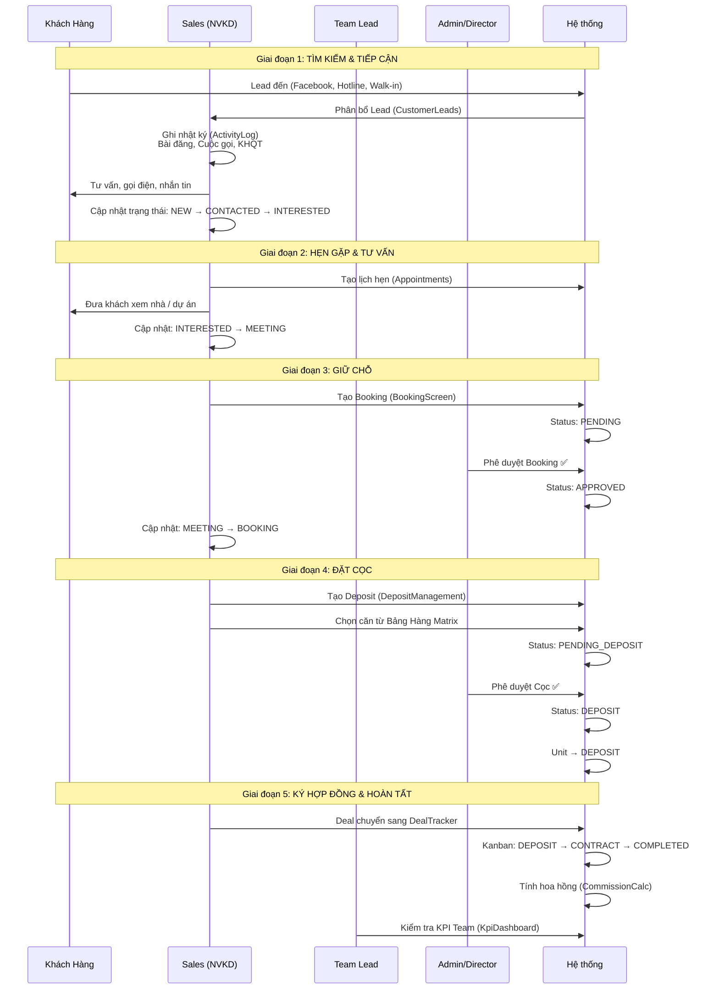
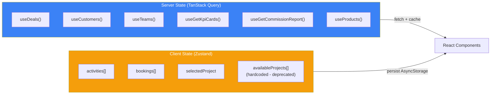

# 📊 Phân Tích Nghiệp Vụ Chi Tiết — Phân Hệ KINH DOANH (Sales Module)

> **SGROUP ERP** — Báo cáo phân tích ngày 13/03/2026

---

## 1. Tổng Quan Phân Hệ

| Thuộc tính | Chi tiết |
|---|---|
| **Tên module** | Kinh Doanh (Sales) |
| **Mục đích** | Quản lý toàn bộ quy trình bán hàng BĐS: từ tìm kiếm khách hàng → giữ chỗ → đặt cọc → ký HĐMB → hoàn tất giao dịch |
| **Đối tượng** | Sales, Team Lead, Sales Manager, Sales Director, CEO, Sales Admin |
| **Số màn hình** | **24** (lớn nhất trong ERP) |
| **Số section** | 7: Dashboard, CRM, Team, Bán hàng, Tài chính, Tài nguyên, Quản trị |
| **Backend API** | 8 nhóm: customers, activities, appointments, products, deals, teams, staff, reports |
| **State Management** | Zustand (local) + TanStack Query (server) |

---

## 2. Phân Quyền Theo Vai Trò (RBAC)

| Chức năng | sales | team_lead | sales_manager | sales_director | ceo | sales_admin |
|---|:---:|:---:|:---:|:---:|:---:|:---:|
| Dashboard | ✅ | ✅ | ✅ | ✅ | ✅ | ✅ |
| CRM & Leads | ✅ | ✅ | ✅ | ✅ | ✅ | ✅ |
| Bảng hàng | ✅ | ✅ | ✅ | ✅ | ✅ | ✅ |
| Nhật ký / Lịch hẹn / Giữ chỗ / Đặt cọc | ✅ | ✅ | ✅ | ✅ | ✅ | ✅ |
| Phê duyệt Booking/Deposit | ❌ | ❌ | ✅ | ✅ | ✅ | ✅ |
| Quản lý Team & Staff | ❌ | ✅ | ✅ | ✅ | ✅ | ✅ |
| Dự án BĐS / Target / CRM Viewer | ❌ | ❌ | ❌ | ✅ | ✅ | ✅ |
| Plan vs Actual | ❌ | ✅ | ✅ | ✅ | ✅ | ✅ |

---

## 3. Sơ Đồ Các Màn Hình Theo Section

---

## 4. Luồng Nghiệp Vụ Chính

### 4.1 Phễu Bán Hàng BĐS (Sales Funnel)

### 4.2 Quy Trình Bán Hàng End-to-End

---

## 5. Chi Tiết Từng Nghiệp Vụ

### 5.1 Dashboard — Tổng Quan Kinh Doanh
**File:** [SalesDashboard.tsx](file:///d:/SGROUP%20ERP%20FULL/SGROUP-ERP-UNIVERSAL/src/features/sales/screens/SalesDashboard.tsx)

| Đối tượng | Nội dung hiển thị |
|---|---|
| **Sales** (cá nhân) | 4 KPI cá nhân (Giao dịch, Hoa hồng, Leads, Lịch hẹn) + Phễu chuyển đổi + Giao dịch gần đây |
| **Team Lead / Manager** | KPI từ API + "Việc Cần Xử Lý" (deals cần follow) + Phễu bán hàng team + Giao dịch gần đây |
| **Director / CEO** | KPI tổng quan toàn bộ + Phễu bán hàng + Giao dịch gần đây (bảng chi tiết) |

**Nguồn dữ liệu:** `useSalesData()`, `useDeals()`, `useGetKpiCards()`, `useGetActualFunnel()`

---

### 5.2 CRM & Leads — Quản Lý Khách Hàng
**File:** [CustomerLeads.tsx](file:///d:/SGROUP%20ERP%20FULL/SGROUP-ERP-UNIVERSAL/src/features/sales/screens/CustomerLeads.tsx)

**Pipeline 7 giai đoạn:**

| Stage | Label | Mô tả |
|---|---|---|
| `NEW` | Mới | Lead vừa tiếp nhận |
| `CONTACTED` | Đã Liên Hệ | Đã gọi / nhắn |
| `INTERESTED` | Quan Tâm | Khách có nhu cầu |
| `MEETING` | Hẹn Gặp | Đặt lịch xem nhà |
| `NEGOTIATION` | Đàm Phán | Đang thương lượng giá |
| `WON` | Chốt | Giao dịch thành công |
| `LOST` | Mất | Khách không mua |

**Chức năng:** Thêm Lead mới (Modal), filter theo status, search theo tên/SĐT, nút chuyển trạng thái nhanh (→ bước tiếp), phân quyền scope (cá nhân / team / toàn bộ).

---

### 5.3 Nhật Ký Hoạt Động
**File:** [ActivityLog.tsx](file:///d:/SGROUP%20ERP%20FULL/SGROUP-ERP-UNIVERSAL/src/features/sales/screens/ActivityLog.tsx)

Sales báo cáo hoạt động hàng ngày gồm 4 chỉ số:

| Chỉ số | Mô tả |
|---|---|
| **Bài đăng** | Số bài marketing đăng trên mạng xã hội |
| **Cuộc gọi** | Số cuộc gọi cold call / follow up |
| **KHQT** | Khách hàng quan tâm mới tìm được |
| **Hẹn gặp** | Số buổi hẹn gặp khách |

**Tính năng:** CRUD inline (sửa/xóa ngay trên bảng), biểu đồ xu hướng theo kỳ (Ngày/Tuần/Tháng/Quý/Năm/Tùy chọn), KPI summary cards.

---

### 5.4 Giữ Chỗ (Booking)
**File:** [BookingScreen.tsx](file:///d:/SGROUP%20ERP%20FULL/SGROUP-ERP-UNIVERSAL/src/features/sales/screens/Booking/BookingScreen.tsx)

**Workflow phê duyệt:**
1. Sales chọn dự án → nhập thông tin khách → nhập số tiền & số lượng giữ chỗ
2. Nhấn **"GỬI PHÊ DUYỆT"** → status `PENDING`
3. Admin/Manager xem bảng lịch sử → **Duyệt ✅** hoặc **Từ chối ❌**

> [!IMPORTANT]
> **Quy tắc KPI:** 1 khách hàng dù có N giữ chỗ vẫn chỉ tính 1 KPI (theo SĐT duy nhất).

**Trạng thái:** `PENDING` → `APPROVED` | `REJECTED` | `CANCELED`

---

### 5.5 Đặt Cọc (Deposit)
**File:** [DepositManagement.tsx](file:///d:/SGROUP%20ERP%20FULL/SGROUP-ERP-UNIVERSAL/src/features/sales/screens/DepositManagement.tsx)

**2 chế độ xem:**
- **Nhập liệu & Lịch sử:** Form đặt cọc (chọn dự án, mã căn, khách hàng, giá trị) + bảng giao dịch
- **Bảng hàng dự án:** UnitMatrix hiển thị sản phẩm theo tầng/block với mã màu trạng thái

**Workflow:** Chọn căn từ Matrix → tự điền mã căn + giá vào form → nhập khách hàng → "GỬI PHÊ DUYỆT"

**Trạng thái:** `PENDING_DEPOSIT` → `DEPOSIT` | `REJECTED` | `CANCELED`

---

### 5.6 Giao Dịch (Deal Tracker)
**File:** [DealTracker.tsx](file:///d:/SGROUP%20ERP%20FULL/SGROUP-ERP-UNIVERSAL/src/features/sales/screens/Deals/DealTracker.tsx)

**Kanban board** với 3 cột trọng điểm:

| Cột | Mô tả |
|---|---|
| **ĐẶT CỌC** (`DEPOSIT`) | Deals đã cọc, chờ ký HĐMB |
| **KÝ HĐMB** (`CONTRACT`) | Đang trong quá trình ký hợp đồng |
| **HOÀN TẤT** (`COMPLETED`) | Giao dịch hoàn tất |

**Cross-module:** Nút "Tra cứu Công nợ (Finance)" link sang module Tài chính.

---

### 5.7 KPI Dashboard
**File:** [KpiDashboard.tsx](file:///d:/SGROUP%20ERP%20FULL/SGROUP-ERP-UNIVERSAL/src/features/sales/screens/KpiDashboard.tsx)

| Vai trò | Nội dung |
|---|---|
| **Sales** | KPI cá nhân: Giao dịch / GMV / Hoa hồng vs Target |
| **Team Lead** | KPI team + Xếp hạng nhân viên trong team |
| **Manager / Director** | 4 KPI cards + Bảng xếp hạng Team (Leaderboard) + Xếp hạng nhân viên toàn bộ |

**Filter:** Tháng/Năm picker + Team filter (cho Manager+)

---

### 5.8 Hoa Hồng (Commission)
**File:** [CommissionCalc.tsx](file:///d:/SGROUP%20ERP%20FULL/SGROUP-ERP-UNIVERSAL/src/features/sales/screens/CommissionCalc.tsx)

| Trạng thái | Ý nghĩa |
|---|---|
| `PENDING` | Tạm tính — chưa ký HĐMB |
| `APPROVED` | Chờ kế toán chi trả |
| `PAID` | Đã thực nhận |

**KPI hiển thị:** Tổng đã thực nhận (Triệu VNĐ) + Tổng tạm tính (đang chờ)

---

## 6. Mô Hình Dữ Liệu (Database Schema)

### 6.1 Bảng chủ đạo

| Model | Mục đích | Quan hệ chính |
|---|---|---|
| `Customer` | Khách hàng & Leads | → FactDeal, Appointment |
| `FactDeal` | Giao dịch bán hàng | → Customer, DimProject, SalesStaff |
| `Appointment` | Lịch hẹn khách | → Customer, DimProject, SalesStaff |
| `SalesStaff` | Nhân viên kinh doanh | → SalesTeam, FactDeal, HrEmployee |
| `SalesTeam` | Team kinh doanh | → SalesStaff[], HrDepartment |
| `DimProject` | Dự án BĐS | → FactDeal, LegalProjectDoc |
| `PropertyProduct` | Sản phẩm (căn hộ) | → (projectId FK) |

### 6.2 Schema FactDeal

| Trường | Mô tả |
|---|---|
| `dealCode` | Mã giao dịch duy nhất |
| `customerId` / `customerName` | Khách hàng |
| `projectId` / `projectName` | Dự án |
| `productCode` | Mã căn |
| `dealValue` / `transactionValue` | Giá trị GD (Tỷ VND) |
| `stage` | LEAD → MEETING → BOOKING → DEPOSIT → CONTRACT → COMPLETED |
| `staffId` / `staffName` | NVKD phụ trách |
| `teamId` / `teamName` | Team phụ trách |
| `commissionRate` / `commissionAmount` | Hoa hồng |

---

## 7. API Architecture

| API Group | Base Path | Chức năng |
|---|---|---|
| **Customers** | `/customers` | CRUD khách hàng + stats |
| **Activities** | `/activities` | CRUD nhật ký + summary |
| **Appointments** | `/appointments` | CRUD lịch hẹn + today |
| **Products** | `/products` | CRUD sản phẩm + lock/deposit/approve/cancel |
| **Deals** | `/sales-ops/deals` | CRUD giao dịch + stats |
| **Teams** | `/sales-ops/teams` | CRUD team |
| **Staff** | `/sales-ops/staff` | CRUD nhân viên sales |
| **Reports** | `/sales-report/*` | KPI cards, plan vs actual, team/staff performance, funnel, commission |

---

## 8. State Management Architecture

> [!WARNING]
> `useSalesStore.availableProjects` và nhiều transaction actions hiện là **hardcoded/deprecated stubs**. Các màn hình Booking/Deposit đang dùng local state thay vì API thực.

---

## 9. Gaps & Đề Xuất Cải Tiến

### 9.1 Gaps Nghiêm Trọng 🔴

| # | Gap | Ảnh hưởng |
|---|---|---|
| G1 | Booking & Deposit dùng **Zustand local** thay vì API → dữ liệu mất khi reload | Không persist được dữ liệu giao dịch thực |
| G2 | `availableProjects` **hardcoded 6 dự án** trong store | Không đồng bộ với DimProject database |
| G3 | Các action `lockUnit`, `requestDeposit`, `approveDeposit` đều là **deprecated stubs** (chỉ `console.warn`) | Bảng hàng không hoạt động thực tế |
| G4 | Chưa có **notification** khi Booking/Deposit được duyệt/từ chối | Admin/Sales không biết kết quả phê duyệt |

### 9.2 Gaps Trung Bình 🟡

| # | Gap | Đề xuất |
|---|---|---|
| G5 | ActivityLog chưa gọi API `/activities` — chỉ lưu Zustand | Migrate sang TanStack Query + API |
| G6 | CommissionCalc phụ thuộc hoàn toàn vào API `/sales-report/commission` — chưa có CRUD | Thêm manual adjustment cho Admin |
| G7 | DealTracker không cho phép drag-and-drop giữa columns | Implement DnD cho workflow Kanban |
| G8 | KpiDashboard không có export PDF/Excel | Thêm nút xuất báo cáo |
| G9 | CustomerLeads chưa có **assign Lead cho NVKD** | Thêm assignment workflow cho Team Lead |
| G10 | Appointments chưa sync Google Calendar | Tích hợp CalDAV/Google Calendar API |

### 9.3 Đề Xuất Ưu Tiên

1. **🔥 Migrate Booking/Deposit sang API** — đây là bottleneck lớn nhất, transactions hiện mất khi reload
2. **🔥 Kết nối `availableProjects` với Project module API** — thay hardcoded bằng `projectApi.getProjects()`
3. **Implement Product lock/deposit API calls** — kích hoạt các deprecated stubs trong store
4. **Real-time notifications** (WebSocket) khi phê duyệt Booking/Deposit
5. **Dashboard analytics mở rộng** — biểu đồ conversion rate, heat map theo thời gian

---

## 10. Kết Luận

Module Kinh Doanh là **module lớn nhất và phức tạp nhất** trong SGROUP ERP với 24 màn hình, 7 sections, và 6 vai trò người dùng. Nó bao phủ toàn bộ chu trình bán hàng BĐS từ Lead → Deal → Commission.

**Điểm mạnh:**
- ✅ RBAC chi tiết 6 vai trò, Dashboard hiển thị khác nhau theo role
- ✅ Pipeline CRM 7 giai đoạn chuyên nghiệp
- ✅ Kanban board cho Deal tracking
- ✅ KPI Dashboard với leaderboard và target tracking
- ✅ TanStack Query migration cho server state

**Điểm yếu cần khắc phục:**
- ❌ Booking/Deposit chỉ lưu local (Zustand), không persist qua reload
- ❌ 6 dự án hardcoded thay vì từ API
- ❌ Nhiều API action là deprecated stubs
- ❌ Thiếu notification system cho approval workflow
