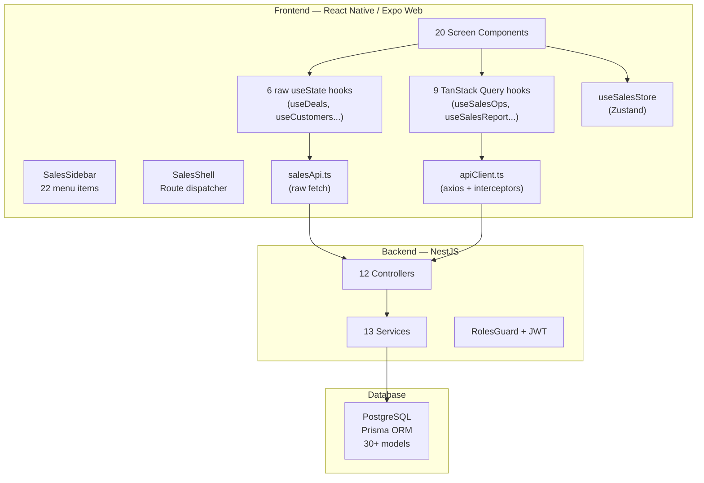

# 🔍 RÀ SOÁT & ĐỀ XUẤT NÂNG CẤP — MODULE KINH DOANH (SALES)

> **Phạm vi**: Full-stack audit — Frontend (React Native/Expo), API Layer, Backend (NestJS/Prisma), Database  
> **Ngày**: 12/03/2026 • **Trạng thái hiện tại**: ~60% MVP, chưa sẵn sàng production

---

## I. TỔNG QUAN KIẾN TRÚC HIỆN TẠI

### Bảng kê tài nguyên

| Layer | Thành phần | Số lượng |
|-------|-----------|----------|
| **Frontend** | Screens | 20 files + 3 dirs |
| | Hooks | 15 files |
| | Components | 4 dirs (charts, forms, inventory, modals) |
| | Store | 1 file (Zustand) |
| | API clients | 2 files (trùng lặp!) |
| **Backend** | Controllers | 12 |
| | Services | 13 |
| | Guards/Decorators | RolesGuard, Roles decorator |
| **Database** | Prisma models | 30+ (Auth, Sales, HR, Planning, Audit) |

---

## II. CÁC VẤN ĐỀ NGHIÊM TRỌNG — Critical Issues

### 🔴 C1. 10 Màn hình hiển thị TRỐNG sau khi xóa mock data

Sau khi xóa tất cả `MOCK_*` constants, **10 màn hình** hiện chỉ render empty arrays, **KHÔNG có API hook nào kết nối chúng với backend**:

| # | Screen | Constant đã xóa | API Hook cần tạo | Backend Endpoint |
|---|--------|-----------------|-------------------|-----------------|
| 1 | `SalesDashboard` | KPI, Funnel, Pipeline | `useGetKpiCards`, `useGetActualFunnel` | ✅ Có (`/sales-report/*`) |
| 2 | `PlanVsActual` | Plan/Actual data | `useGetPlanVsActual` | ✅ Có (`/sales-report/plan-vs-actual`) |
| 3 | `CommissionCalc` | Commission records | `useGetCommissionReport` | ✅ Có (`/sales-report/commission`) |
| 4 | `DealRecording` | Deals | `useGetDeals` | ✅ Có (`/sales-ops/deals`) |
| 5 | `StaffManagement` | Staff list | `useGetStaff` | ✅ Có (`/sales-ops/staff`) |
| 6 | `ProjectCatalog` | Projects | `useGetProjects` | ✅ Có (`/sales-ops/projects`) |
| 7 | `Training` | Courses, Certs | ❌ **Chưa có** | ❌ **Chưa có** |
| 8 | `Timekeeping` | Attendance | ❌ **Chưa có** | ❌ Dùng HR (`HrAttendance`) |
| 9 | `Policies` | Policies | ❌ **Chưa có** | ❌ **Chưa có** |
| 10 | `ProjectDocs` | Documents | ❌ **Chưa có** | ❌ **Chưa có** |

> [!CAUTION]
> **6 screens có backend API sẵn sàng** nhưng chưa được wire up. **4 screens hoàn toàn chưa có backend** — cần quyết định: build API hay hardcode static content?

---

### 🔴 C2. Kiến trúc API Client bị trùng lặp (Dual API pattern)

Hiện tại có **2 API client song song** gọi cùng 1 backend:

| File | Tech | Auth | Dùng bởi |
|------|------|------|----------|
| [`salesApi.ts`](file:///d:/SGROUP%20ERP%20FULL/SGROUP-ERP-UNIVERSAL/src/features/sales/api/salesApi.ts) | Raw `fetch` | Manual token via `setSalesApiToken()` | 6 raw `useState` hooks |
| [`apiClient.ts`](file:///d:/SGROUP%20ERP%20FULL/SGROUP-ERP-UNIVERSAL/src/core/api/apiClient.ts) | `axios` + interceptors | Auto token from `AsyncStorage` | TanStack Query hooks (`useSalesOps`, `useSalesReport`) |

**Vấn đề**: 
- `salesApi.ts` token phải set thủ công → dễ desync với auth flow
- `apiClient.ts` tự động đọc token → an toàn hơn
- 2 error handling flows khác nhau
- Maintenance overhead x2

---

### 🔴 C3. Zustand Store vẫn chứa hardcoded data & logic client-side

[useSalesStore.ts](file:///d:/SGROUP%20ERP%20FULL/SGROUP-ERP-UNIVERSAL/src/features/sales/store/useSalesStore.ts) vẫn:
- **Hardcoded 9 project names** trong `availableProjects` (line 103-113)
- **Toàn bộ business logic** (lock unit, deposit, approve...) chạy **client-only** — KHÔNG gọi API
- State mất khi refresh page → **không persistent**

---

### 🔴 C4. Hai hệ thống Hook song song không thống nhất

| Pattern | Files | Tech | Cache | Refetch |
|---------|-------|------|-------|---------|
| **Raw useState** | `useDeals`, `useCustomers`, `useActivities`, `useAppointments`, `useTeams`, `useProducts` | `useState` + `useEffect` + `fetch` | ❌ | ❌ Manual |
| **TanStack Query** | `useSalesOps`, `useSalesReport`, `useSalesData` | `useQuery`/`useMutation` | ✅ Auto | ✅ Auto |

> [!WARNING]
> 6 hooks dùng `useState` pattern sẽ **re-fetch mỗi lần mount**, không có cache, stale-while-revalidate, hay optimistic updates. Nên migrate tất cả sang TanStack Query.

---

## III. CÁC VẤN ĐỀ CẦN CẢI THIỆN — Important Issues

### 🟡 I1. Routing client-side — không có deep link / URL routing

`SalesShell.tsx` dùng `useState('SALES_DASHBOARD')` để điều hướng:
- Không có URL routing → không bookmark, không share link
- Back button không hoạt động
- Refresh = reset về Dashboard

### 🟡 I2. Role-based Access chỉ kiểm soát ở **sidebar visibility**, không enforce ở screen level

- Sidebar filter items theo `minRole` ✅
- Backend controller dùng `@Roles()` guard ✅  
- **Screen components KHÔNG check role** trước khi render actions (edit, delete, approve) ❌
- User có thể truy cập trực tiếp nếu biết `KEY_TO_COMPONENT` mapping

### 🟡 I3. Error Handling & Loading States thiếu đồng bộ

- Không có global error boundary
- 6 raw `useState` hooks catch lỗi nhưng **không hiển thị cho user**
- Không có retry mechanism trên frontend
- Backend 401 chỉ `console.warn` + xóa token, không redirect

### 🟡 I4. Thiếu Empty State UI

Sau khi xóa mock data, các screen chỉ render danh sách rỗng → user thấy màn hình **trắng trơn**. Cần:
- Illustration / icon cho empty state
- CTA "Thêm mới" hoặc "Liên hệ admin"
- Skeleton loading khi đang fetch

### 🟡 I5. Type Safety yếu — quá nhiều `any`

- `salesApi.ts`: tất cả `create/update` nhận `data: any`
- `SalesOpsAPI`: controllers nhận `@Body() body: any` cho update
- Hook returns untyped
- Screen props dùng `any` cho columns, render functions

### 🟡 I6. Backend thiếu validation (DTO)

- Không dùng `class-validator` / `ValidationPipe`
- `@Body() body: any` → client gửi gì nhận nấy
- SQL injection risk qua Prisma thấp nhưng business logic bypass cao

---

## IV. PHÂN TÍCH THEO TỪNG MÀN HÌNH

### Dashboard (`SalesDashboard.tsx`) — ⚠️ Empty

| Metric | Status |
|--------|--------|
| Backend API | ✅ `GET /sales-report/kpi-cards`, `/funnel` |
| Frontend Hook | ✅ `useGetKpiCards`, `useGetActualFunnel` (TanStack Query — **CÓ nhưng CHƯA dùng**) |
| Data display | ❌ Empty arrays: `TEAM_KPI`, `TEAM_FUNNEL`, `PERSONAL_PIPELINE` |
| **Fix**: Wire `useGetKpiCards()` + `useGetActualFunnel()` vào component | Priority: **P0** |

### Deals (`DealTracker.tsx` vs `DealRecording.tsx`) — ⚠️ Confusing

- **2 màn hình deals** tồn tại song song
- `DealTracker` đã wire `useGetDeals()` (TanStack Query) ✅
- `DealRecording` vừa bị xóa mock, empty, **không dùng hook nào** ❌
- **Đề xuất**: Merge `DealRecording` vào `DealTracker` hoặc xóa bỏ

### Booking (`BookingScreen.tsx`) — ✅ Functional

- Dùng `useSalesStore` (Zustand) cho state
- Logic client-side: lock, deposit, approve
- **Rủi ro**: Data mất khi refresh, concurrent booking conflict

### Commission, Plan vs Actual, Staff, Projects — ⚠️ Backend ready, frontend empty

Tất cả có sẵn API + TanStack Query hooks nhưng screens **chưa wire up**.

### Training, Timekeeping, Policies, ProjectDocs — ❌ No backend

Cần CRUD API hoặc quyết định dùng static content.

---

## V. ĐỀ XUẤT NÂNG CẤP — Upgrade Roadmap

### Phase 1 — Wire Up Existing APIs (ưu tiên cao nhất, ~3 ngày)

> Mục tiêu: Tất cả 22 screens hiển thị data thật từ API

| Task | Screen(s) | Hook cần dùng | Effort |
|------|-----------|---------------|--------|
| 1.1 | `SalesDashboard` | `useGetKpiCards`, `useGetActualFunnel` | 4h |
| 1.2 | `PlanVsActual` | `useGetPlanVsActual` | 2h |
| 1.3 | `CommissionCalc` | `useGetCommissionReport` | 2h |
| 1.4 | `DealRecording` → merge vào `DealTracker` | `useGetDeals` | 3h |
| 1.5 | `StaffManagement` | `useGetStaff` | 2h |
| 1.6 | `ProjectCatalog` | `useGetProjects` | 2h |
| 1.7 | Add Empty State + Skeleton Loading components | Tất cả | 4h |

### Phase 2 — Unify API & Hooks Architecture (~2 ngày)

| Task | Detail |
|------|--------|
| 2.1 | **Xóa `salesApi.ts`**, migrate 6 raw hooks sang TanStack Query + `apiClient.ts` |
| 2.2 | Migrate `useSalesStore` actions sang API calls (lock unit, deposit, booking) |
| 2.3 | Xóa hardcoded `availableProjects`, fetch từ `GET /sales-ops/projects` |
| 2.4 | Add proper TypeScript interfaces cho tất cả API responses |

### Phase 3 — UX & Reliability (~2 ngày)

| Task | Detail |
|------|--------|
| 3.1 | Global `ErrorBoundary` component |
| 3.2 | `SGEmptyState` component với illustration + CTA |
| 3.3 | `SGSkeletonLoader` cho cards, tables |
| 3.4 | Toast notification system cho mutations (success/error) |
| 3.5 | URL-based routing hoặc deep-link params |

### Phase 4 — Backend Hardening (~2 ngày)

| Task | Detail |
|------|--------|
| 4.1 | Add `class-validator` DTOs cho tất cả `@Body()` |
| 4.2 | Build APIs cho Training, Timekeeping, Policies, ProjectDocs |
| 4.3 | 401 interceptor: auto-redirect to login |
| 4.4 | Rate limiting, request logging |
| 4.5 | Seed data script cho demo/staging |

### Phase 5 — Security & Role Enforcement (~1 ngày)

| Task | Detail |
|------|--------|
| 5.1 | Frontend role guard wrapper cho action buttons |
| 5.2 | Audit log cho mutations (create, update, delete, approve) |
| 5.3 | Data isolation: sales chỉ thấy data của mình |
| 5.4 | Input sanitization trên cả frontend + backend |

---

## VI. VẬN HÀNH — Deployment Checklist

Trước khi go-live, cần hoàn thành:

- [ ] Seed data production (Projects, Teams, Staff, Users)
- [ ] Environment variables cho production backend
- [ ] CORS config cho production domain
- [ ] Health check endpoint (`GET /health`)
- [ ] Database backup strategy
- [ ] Monitoring (error tracking — Sentry)
- [ ] User acceptance testing (UAT) với sales team thật
- [ ] Training/onboarding cho end users
- [ ] Rollback plan nếu có lỗi production

---

## VII. ĐÁNH GIÁ TỔNG THỂ

| Tiêu chí | Điểm | Ghi chú |
|----------|-------|---------|
| **Database Schema** | 9/10 | Comprehensive, well-normalized |
| **Backend API** | 7/10 | CRUD đầy đủ, thiếu validation DTOs |
| **Frontend-Backend Integration** | 3/10 | Hầu hết screens chưa wire up |
| **State Management** | 4/10 | Dual pattern, client-only business logic |
| **UX/UI Design** | 7/10 | Premium design, thiếu empty/loading states |
| **Security** | 5/10 | JWT + RBAC cơ bản, thiếu frontend guard |
| **Type Safety** | 4/10 | Quá nhiều `any` |
| **Production Readiness** | 3/10 | Cần hoàn thành Phase 1-3 minimum |

> [!IMPORTANT]
> **Khuyến nghị**: Ưu tiên **Phase 1 (Wire Up APIs)** ngay lập tức — đây là bottleneck lớn nhất. Backend đã sẵn sàng ~70%, nhưng frontend chỉ kết nối ~30% các endpoints có sẵn.
